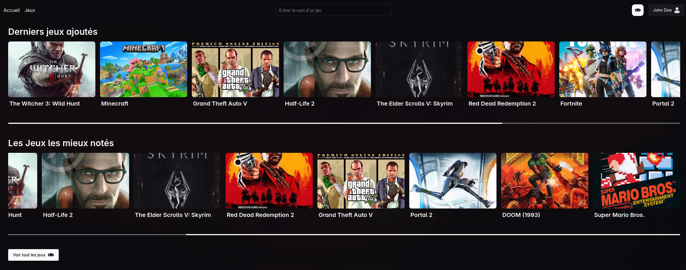
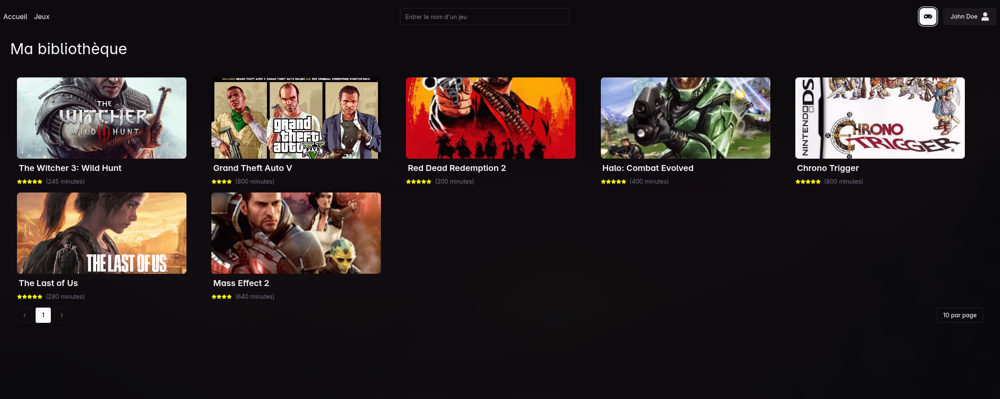

# Gameo - Gestion de collection de jeux

Mini projet d'application de jeu développé avec TypeScript, Node.js, et React.

Mise en place d’une plateforme permettant aux utilisateurs de gérer leur collection de jeux, d’ajouter de nouveaux titres à leur bibliothèque, de partager leur avis, d’indiquer le temps de jeu et d’attribuer une note à chaque jeu.


## Demo

compte de test : email: test@gmail.com / mdp: Test1234!

- [Lien vers la démo](https://gameo-web.nikho.dev): https://gameo-web.nikho.dev






## ✨ Fonctionnalités

- Authentification (inscription / connexion)
- Ajout, modification et suppression de jeux dans sa bibliothèque
- Attributs : titre, note (/5), temps passé
- Recherche et tri par titre, note, temps ou date d’ajout
- Espace public :
    - Jeux les plus populaires
    - Jeux récemment ajoutés
    - Recherche par titre
- Pagination des résultats

## 🛠️ Stack technique

- React
- Express
- PostgreSQL
- Bun
- Turborepo
- Drizzle
- Typebox
- Tanstack Router, Query and Form
- Zustand
- Tailwind CSS
- Chakra UI
- Docker
- GitHub Actions
- PostgreSQL
- Redis
- fp-ts, neverthrow & ts-pattern (function programming libraries)

## ⚙️ Prérequis

- [Bun](https://bun.sh/) (v1.2.21)
- [Docker / Docker compose](https://www.docker.com/) 

## 🚀 Installation & lancement

1. Cloner le repo et installer les dependencies :
    ```bash
    git clone git@github.com:frnikho/privio.git
    cd privio
    bun install
    ```
   
2. Copier les fichiers `.env.exemple` dans chaque package et ajuster les variables d'environnement ou laisser les valeurs par défaut.
    ```bash
    cp .env.exemple .env
    ```

3. Démarrer les services tiers avec Docker Compose :
    ```bash
   docker compose up -d
    ```
   
4. Charger les variables d'environnement dans le shell courant :
    ```bash
    source .env // ou loadenv pour fish (https://github.com/berk-karaal/loadenv.fish)
    ```

5. Lancer la migration et le seed de la base de données :
    ```bash
    cd apps/api
    bun run migrate
    bun run seed
    ```
6. De retour à la racine, démarrer l'application en mode développement :
    ```bash
    bun dev --env-mode=loose
    ```

## 📂 Structure

- `apps/web` → app React (Vite + TanStack Router + UI lib)
- `apps/api` → API Express + routes REST
- `packages/types` → types partagés entre le front et le back
- `docker-compose.yml` → stack de dev (Postgres + Redis)
- `docker-compose.prod.yml` → stack complète (API + Front + DB + Redis)

## Production
```bash
docker-compose -f docker-compose.prod.yml up --build
```